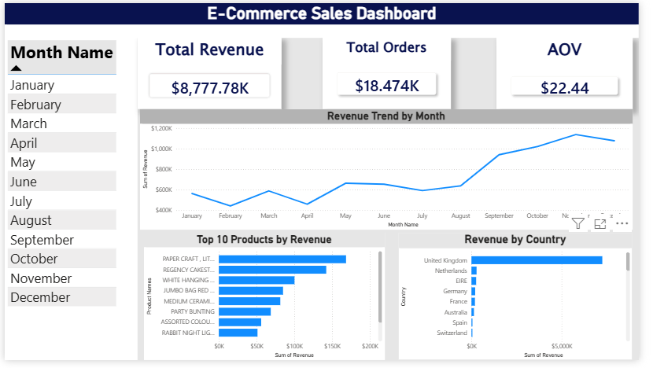

# 📊 E-Commerce Sales Dashboard

## 📌 Project Overview
This project focuses on analyzing e-commerce transaction data and building an interactive dashboard using Power BI to uncover key business insights.

## 🎯 Objectives
- Analyze sales performance over time
- Identify top-performing products
- Understand revenue distribution by country
- Calculate key KPIs (Revenue, Orders, Average Order Value)

## 🛠 Tools Used
- Power BI (Data cleaning & visualization)

## 📊 Dashboard Preview

## 📈 Key Insights
- Revenue shows a clear growth trend toward the end of the year
- A small number of products generate most of the revenue
- The United Kingdom contributes the highest share of revenue

## 📂 Files
- `ecommerce_dashboard.pbix` → Interactive Power BI dashboard
- `dashboard.png` → Dashboard preview

## 🚀 Conclusion
This project demonstrates how raw data can be transformed into meaningful insights through data cleaning and visualization.
